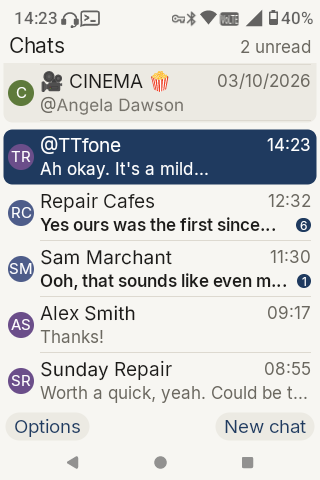
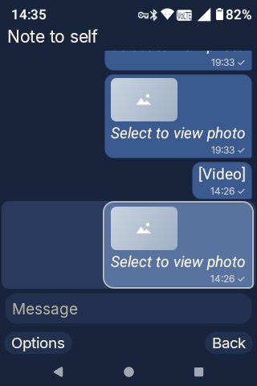
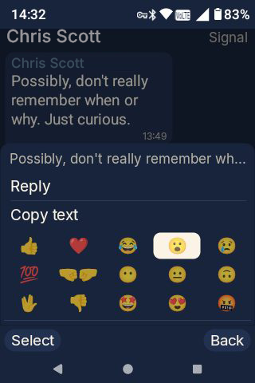
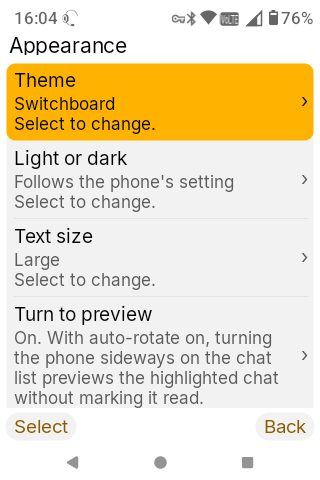

# Operator

*There is no smartphone.*

Operator is a chat app for **keypad phones**, or **dumbphones** as they're often called: Android feature phones with a D-pad, soft keys and a T9 keypad, such as the TTfone TT990. It shows WhatsApp, Signal, Telegram, Messenger, Instagram, Discord and the rest in one list, with notifications that work **without Google services**, on hardware that would struggle with any ordinary chat app.

It does this as a [Matrix](https://matrix.org) client signed in to your existing [Beeper](https://beeper.com) account. Beeper connects your chat networks; Operator is the keypad-phone window into them. Operator has no servers of its own, no analytics, no crash reporting, and no Google Play Services, Firebase or microG. It is free software (GPL-3.0-or-later), not affiliated with Beeper, Matrix.org or any phone maker.

**Status: public beta.** It works and is in daily use on two phones. Expect rough edges, and please [report them](#reporting-a-problem).

## Get Operator

**[⬇ Download the APK (0.3.0-beta, 16 MB)](https://github.com/OperatorChat/Operator/releases/download/v0.3.0-beta/operator-0.3.0-beta.apk)** — copy it to the phone and open it from the Files app. Other ways: [Obtainium](https://github.com/ImranR98/Obtainium) (add this repository's address and it installs and updates for you), the [IzzyOnDroid](https://apt.izzysoft.de/fdroid/) repository in the F-Droid app, and F-Droid itself once its review is done.

Then, in this order:

1. **Set up Beeper on a computer** and connect your chat apps there. Operator can't talk to WhatsApp or Signal itself; Beeper does that and puts everything into one encrypted Matrix account, which is what Operator signs in to. Beeper's own help and community cover this part.
2. **Give your Beeper account a password.** Beeper normally signs you in by emailed code; Operator signs in with a password, and it can set one for you from its sign-in screen.
3. **Find your recovery key** in Beeper (Settings → Beeper Profile → menu → Show Recovery Key). Your chats are encrypted, and this key is what lets a new device read them. Operator asks for it once.
4. **Install Operator, sign in, approve the phone with the key, and work through the short setup checklist** so notifications keep arriving when the phone sleeps.

The [user guide](docs/user-guide.md) walks through every step with the exact screens and a trick for pasting the key instead of typing it on T9. The [FAQ](docs/faq.md) answers the questions people ask first.

<p>




</p>

## What it does

- **All your chats in one list**, with avatars, unread counts and pinned chats, driven entirely by the D-pad and keypad. Touchscreens work too, but the point is button control first for dumbphones.
- **Read and reply**, with delivery and read marks, replies, edits, delete for everyone, and reactions from a grid of emojis. Your messages change colour alongside delivery and read marks to see their status at a glance.
- **Photos on demand**: nothing downloads until you ask, to avoid eating up limited storage dumbphones often have. Send photos from the gallery or camera. Open or save files sent to you.
- **Mentions**: see when you've been mentioned, mute a group except for mentions, and mention people from the group's member list via a convenient menu rather than typing names.
- **Battery**: Very light on the battery, using only 2 or 3 % per day on current tests. Might differ on other phones, we'll have to see.
- **Links** open in the phone's browser when you choose to do so from their context menu, never on their own. Multiple links appear individually in the message's context menu.
- **Notifications in seconds** through a tiny relay that never sees message content. Optional screen wake. Your own relay server can be used instead.
- **Themes** (Operator, Slate, Switchboard, Matrix, High contrast), light and dark, three text sizes.
- **Turn to preview**: on phones that rotate the screen, turning the handset sideways on the chat list previews the highlighted chat without marking the messages as read.

Not yet: calls, voice-note recording, threads, polls, creating groups, SMS.

## Verifying a download

Official builds are signed with a certificate whose SHA-256 fingerprint is `c978a97c7ce5eb6b4cd4cb14416e2f0fb2d15945c6f9795dd80cdc0bf7431f34`. F-Droid's own builds carry F-Droid's signature instead.

## Privacy and security

Messages are end-to-end encrypted by the Matrix protocol. Operator's local database is encrypted at rest with a key held in the phone's hardware keystore. The push relay carries only a content-free wake-up signal. Nothing is sent to the Operator project. The details are in the [privacy policy](docs/privacy.md) and the [security notes](docs/security.md). To report a vulnerability, see [SECURITY.md](SECURITY.md).

## Reporting a problem

In the app: **Settings → Report a problem** drafts an email with the phone model, Android and Operator versions and recent technical log lines (never message content). Or open an [issue](../../issues). Please include the phone model and what the screen said.

## Supporting Operator

Operator is free and will stay free. Donations go towards further development, such as a dedicated notification relay and domain, so the app does not depend on a public server.

- [Ko-fi: ko-fi.com/operatorchat](https://ko-fi.com/operatorchat)
- [GitHub Sponsors: github.com/sponsors/OperatorChat](https://github.com/sponsors/OperatorChat)

Both links are at the top of Settings in the app.

## Building

Requirements: Android Studio (for its bundled JDK 21 and the Android SDK, platform 36). Nothing else.

```bash
export JAVA_HOME="/Applications/Android Studio.app/Contents/jbr/Contents/Home"   # macOS
./gradlew :app:assembleOperatorDebug
adb install -r app/build/outputs/apk/operator/debug/app-operator-debug.apk
```

Release builds: `./gradlew :app:assembleOperatorRelease` (about 16 MB; code shrinking is off by default, `-Pminify` turns it on). Signing uses a `keystore.properties` file at the repository root, never committed. See [docs/releasing.md](docs/releasing.md).

| Module | What it holds |
|---|---|
| `app` | The UI (Android Views), notifications, settings. Branding in the `operator` flavour. |
| `core-matrix` | Login, sync, rooms, timeline, send, media, encryption, key backup, verification. Adapted from [fenleon/chats](https://github.com/fenleon/chats) (MIT) on [Trixnity](https://gitlab.com/connect2x/trixnity) (Apache 2.0). |
| `core-beeper` | Beeper-specific behaviour: password setup by email, bridge contacts and new chats. |
| `core-push` | The built-in ntfy channel, the UnifiedPush connector, pusher registration. |

Contributions are welcome: see [CONTRIBUTING.md](CONTRIBUTING.md).

### Rebranding

The build is designed so a phone maker can ship its own branded version: a product flavour in `app/build.gradle.kts` plus a `src/<flavour>/res/values/brand.xml` (app name, default homeserver and push server, support addresses, about text, colours) and a launcher icon. Under the GPL that build must be published with its source, keep Operator's credits, and use its own name and icon (see [TRADEMARK.md](TRADEMARK.md)). A manufacturer that would rather not publish its changes, wants to keep the Operator branding, or wants support, can get in touch about a commercial licence: unsaved-fax-even@duck.com.

## Credits

- Made by [Spanorak](https://www.reddit.com/user/Spanorak).

- [Chats](https://github.com/fenleon/chats) by Fenn: the Matrix layer and the ntfy push design come from this project. MIT License.
- [Trixnity](https://gitlab.com/connect2x/trixnity): the Matrix SDK and encryption. Apache License 2.0.
- [SQLCipher](https://www.zetetic.net/sqlcipher/) (BSD) for the encrypted database; [ntfy](https://ntfy.sh) and the [UnifiedPush connector](https://unifiedpush.org) (Apache 2.0) for notifications.
- The [Inter](https://rsms.me/inter/) typeface (SIL Open Font License) and [Material Symbols](https://fonts.google.com/icons) glyphs (Apache 2.0).

## Licence

Copyright (C) 2026 [Spanorak](https://www.reddit.com/user/Spanorak). Operator is free software under the [GNU General Public License v3.0 or later](LICENSE): you may use, study, share and improve it, and anyone who distributes a modified version, including a rebranded one, must publish their source under the same licence and keep the credits. Third-party notices: `core-matrix/LICENSE-fenleon-chats.txt` (MIT), `LICENSE-inter.txt` (OFL).

The name "Operator" and the headset mark are trademarks of Spanorak and are not covered by the GPL; forks must use their own name and icon. The artwork files are licensed for official builds only. See [TRADEMARK.md](TRADEMARK.md).

Operator is also available under a commercial licence for organisations that want to ship it without the GPL's source-sharing obligation, or under their own brand. Enquiries: unsaved-fax-even@duck.com.
